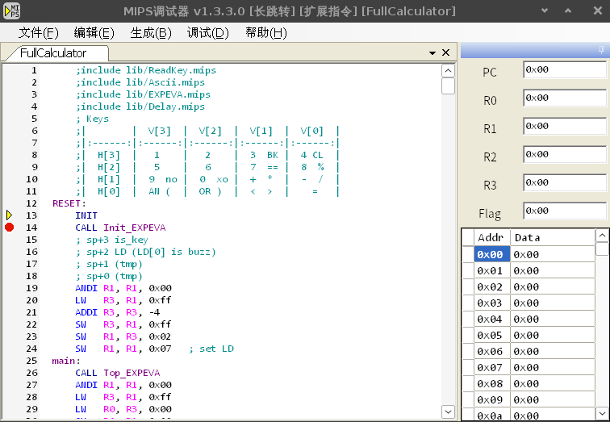

# Simple Yet Powerful: Adding Stacks and Function Calls to an 8-bit CPU

## Introduction

This project originated as a junior-level undergraduate course assignment. The initial requirement was to design a simple CPU with 4 registers and write a basic calculator application. I chose to push the boundaries of the project by implementing advanced features like stack operations and function calls. This was achieved through custom physical/virtual instructions such as `push`, `pop`, `call`, `ret`, and `addpc`. These additions enabled modular assembly programming, and I went further by developing:

- A **standard library**.
- An **Integrated Development Environment (IDE)** in C# with features like:
  - Syntax checking and highlighting
  - Code formatting
  - Assembler
  - Simulator
  - Debugger
  - FPGA programmer

The final product included a calculator application with full operator precedence and support for 16-bit multiplication and division. The IDE was open-sourced to help all 140 students in the class.

## Features

1. **Processor Design**:
   - 8-bit, 4-register CPU implemented in Verilog.
   - Enhanced with PC-related operations `LPCH`, `LPCL`, `SPC` allowing more power virtual instructions:
     - stack operations (`push`, `pop`)
     - function call instructions (`call`, `ret`)
     - switch-case (`addpc`)

2. **IDE (AssemblerGui)**:
   - Provides an assembler, simulator, and debugger.
   - Features syntax checking, automatic formatting, and support for various machine code outputs (e.g., Intel HEX, binary).
   - Open-sourced for collaborative development and use.

3. **Calculator Application**:
   - Supports full operator precedence.
   - Capable of performing 16-bit multiplication and division.

4. **Educational Impact**:
   - Open-sourced IDE was widely adopted by peers, benefiting 140 students in the course.

## IDE Usage Guide

### Editor
The editor allows you to create and modify MIPS files. Features include:
- Standard file operations: New, Open, Save, Save As.
- Automatic code formatting for consistent style (4-space indents, uppercase instructions, and registers).

Syntax errors are displayed with detailed information, and the cursor automatically moves to the error location for quick fixes.

### Assembler
The assembler converts MIPS files into various machine code formats:
- **Intel HEX**: For ROM initialization in tools like Quartus.
- **Binary/Hexadecimal Machine Code**: Generates `.txt` files with binary or hexadecimal representation.
- **Expanded Assembly**: Converts extended instructions into raw MIPS instructions.
- **ROM Download**: Directly updates the FPGA ROM with assembled machine code.

Syntax errors during assembly provide detailed error reports, ensuring seamless debugging.

### Debugger
The debugger simulates the execution of MIPS files. Key features:
- Start execution or step through instructions.
- Pause execution to inspect and modify registers or memory.
- Breakpoints for conditional pauses.
- Step through instructions, statements, or entire procedures.

### Notes
- Be cautious when modifying the program counter (PC) during debugging to avoid unexpected behavior.
- Use advanced options (`Enable Long Jumps` and `Enable Extended Instructions`) only when necessary and with a clear understanding.

## Contributions
This project showcases how extending a simple course requirement can lead to a robust, educational tool that benefits an entire class. By open-sourcing the IDE, I demonstrated the importance of collaborative development in education.

## Repository
Find the source code and additional documentation on GitHub: [Simple 8-bit CPU Project](https://github.com/b1f6c1c4/CPU).
